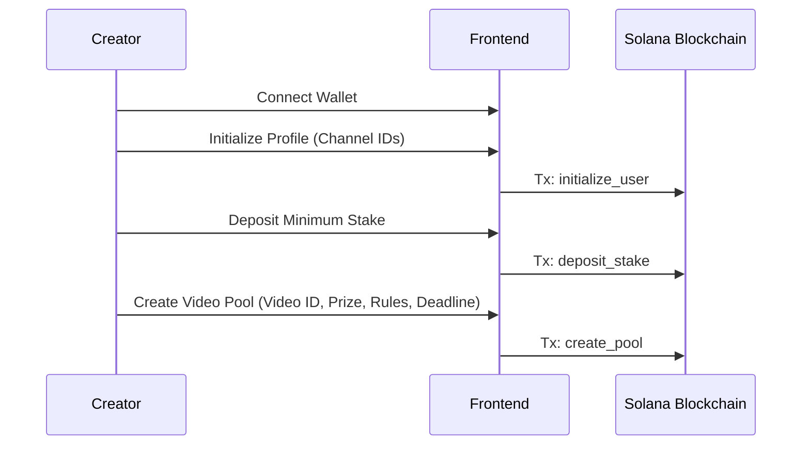
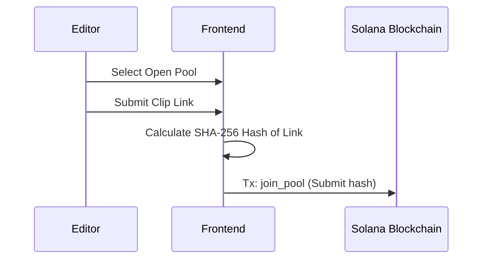
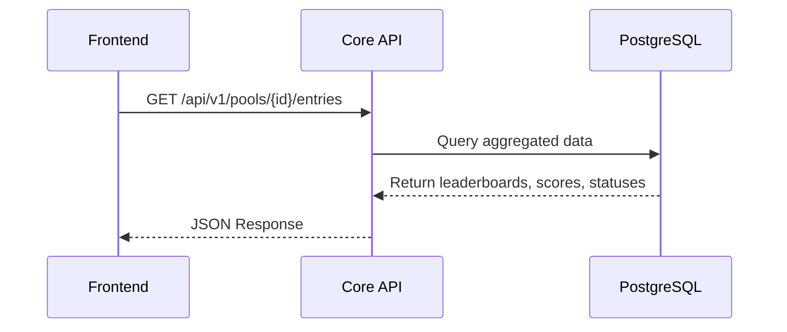
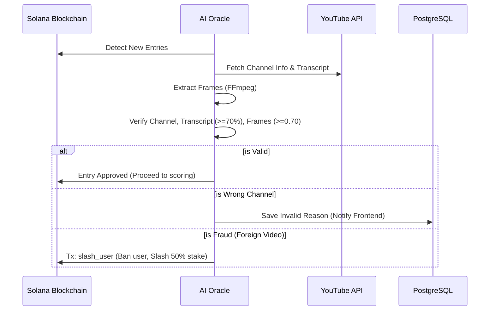
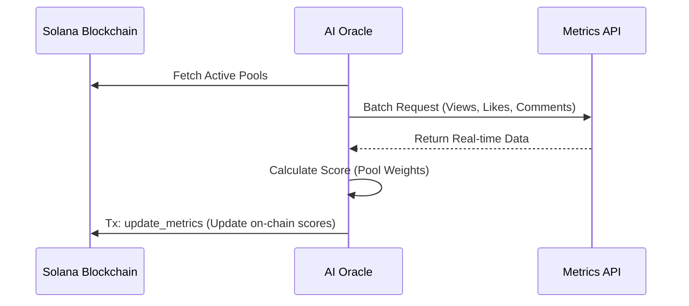
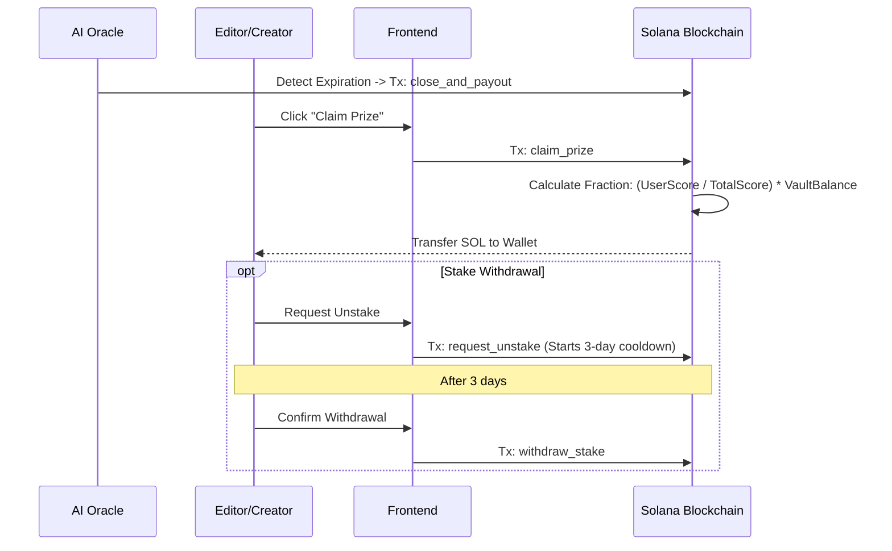

# SolCuts Project Flows

This document details all the end-to-end flows of the **SolCuts** project, from frontend interactions to backend processing, the artificial intelligence oracle, and smart contracts on the Solana blockchain. It also lists the flows that still need to be implemented.

---

## 🌊 Implemented Flows

### 1. Creation and Setup Flow (Creator/Influencer)
1. **Wallet Connection**: The user connects to the `Dashboard-solana-front` with their Solana wallet.
2. **Profile Initialization**: If it is the first access, the user initializes their profile (`initialize_user`) by linking their channel IDs.
3. **Stake Deposit**: The user deposits a minimum stake amount (`deposit_stake`) to be able to participate and create pools.
4. **Pool Creation**: The creator creates a new "Video Pool" (`create_pool`), providing:
   - Original video ID.
   - Prize amount (in SOL).
   - Scoring rules (weight of views, likes, and comments).
   - Expiration deadline.
   The transaction is signed on Solana.

### 2. Participation Flow (Video Editor)
1. **Clip Submission**: On the frontend, the editor chooses an open pool and submits the link to their clip.
2. **Local Hashing**: The frontend calculates the SHA-256 hash of the link to ensure the clip's uniqueness.
3. **Joining**: The editor signs the `join_pool` transaction on the blockchain. From this moment, the submission enters the Oracle's analysis queue.

### 3. Read and Leaderboards Flow (Core API)
To avoid overloading the blockchain's RPC queries, the applications (Frontend) fetch optimized data from the `core-api`:
1. **Pool and Entry Queries**: The frontend makes REST requests (e.g., `GET /api/v1/pools/{id}/entries`) to the Core API.
2. **Consolidated Data Read**: The API returns aggregated data (real-time leaderboards, scores, statuses) directly from a relational database (PostgreSQL).

### 4. Anti-Fraud Validation Flow (AI Oracle)
The off-chain Artificial Intelligence agent (`AI_agente-Oracle_colosseum_Hackathon`) runs in a continuous polling loop:
1. **Detection**: The Oracle detects new entries on the blockchain.
2. **Automated Validation Pipeline**:
   - **Channel Verification**: Checks if the video posted by the editor belongs to the creator's list of channels.
   - **Transcript Verification**: Fetches the video transcript (`youtube-transcript-api`) and requires a $\ge 70\%$ similarity with the original video.
   - **Frame Verification**: Extracts video frames via FFmpeg at key points and calculates structural similarity (SSIM). At least 3 out of 5 frames must have a similarity $\ge 0.70$.
3. **Decision and Punishment**:
   - **Valid**: The entry proceeds to be accounted for.
   - **Wrong Channel**: If the clip is on another channel of the creator (not the expected one), the entry is silently invalidated and the reason is saved in the database to notify the frontend.
   - **Fraud**: If the video belongs to third parties, the Oracle automatically executes the slashing (`slash_user`) via CPI on Solana, banning the user and transferring 50% of their stake to the treasury.

### 5. Metrics Update Flow (Oracle & Metrics API)
1. **Constant Fetching**: The Oracle periodically fetches active pools.
2. **External Collection**: The Oracle makes batch requests to the **Metrics API** (`api-data-videos`) fetching real-time data (Views, Likes, Comments) for each validated entry.
3. **On-Chain Update**: The Oracle calculates the score based on the pool's weights and executes the `update_metrics` instruction on Solana, updating the score of the entries on-chain.

### 6. Closure and Payout Flow
1. **Pool Finalization**: When the pool's deadline expires (`expiry_timestamp`), the Oracle detects the expiration and invokes the `close_and_payout` instruction to seal the global scores.
2. **Prize Claim**: Winning editors interact with the frontend to invoke the `claim_prize` function. The Smart Contract calculates the exact fraction (`(UserScore / TotalScore) * VaultBalance`) and transfers the SOL balance from the vault to the editor's wallet.
3. **Stake Withdrawal**: If they wish to exit, editors or creators can request `request_unstake` (initiating a 3-day cooldown) and subsequently confirm the `withdraw_stake`.

---

## 🚧 Missing Flows (To Be Implemented)

Despite the robust infrastructure and the fact that most of the contracts and logic are already defined, there are still the following gaps in the project flow:

1. **Blockchain Indexer Worker (DB Synchronization)**
   - *Status*: To be implemented.
   - *Description*: The `core-api` currently exposes REST endpoints, but lacks the Worker that listens to events or polls (Websockets/RPC) natively on the Solana network to populate and keep the PostgreSQL database updated with new events like `PoolCreated`, `EntryAdded`, `MetricsUpdated`, etc.

2. **Visual Feedback Flow on Frontend (Fraud Handling)**
   - *Status*: Partially implemented.
   - *Description*: It is necessary to develop screens/alerts in the interface (`Dashboard-solana-front`) to actively inform the user of the reasons for validation failure (e.g., reading audit logs returned by the backend pointing out `FRAUD_CHANNEL` or `INVALID_TRANSCRIPT`).

3. **Oracle Deployment and Testing on Real Network/Devnet**
   - *Status*: Pending.
   - *Description*: As registered in the agent's plan, the Oracle's final keys need to be generated and the oracle flow requires E2E testing running loops together with the contracts on Devnet or Mainnet (Final integration tests between Python and Rust).

4. **Admin Dashboard**
   - *Status*: To be implemented on frontend.
   - *Description*: The contracts contain the `update_config` instruction (which changes the minimum stake, platform fees, and authorities), but there is no flow in the UI for the treasury/administration to manage these parameters visually.

5. **Mobile Application**
   - *Status*: Planned for the future.
   - *Description*: The ecosystem envisions a Mobile App for editors to manage their stakes and withdraw prizes easily, which currently does not have a repository or screens.

6. **Centralized "Claim" View on Frontend**
   - *Status*: To be implemented.
   - *Description*: A unified "Rewards" section (`/bounties` or `/claim`) on the frontend, where the editor can view a consolidated history of all expired pools in which they earned fractions of SOL, and a "Claim All" button or a list of claims awaiting withdrawal.
