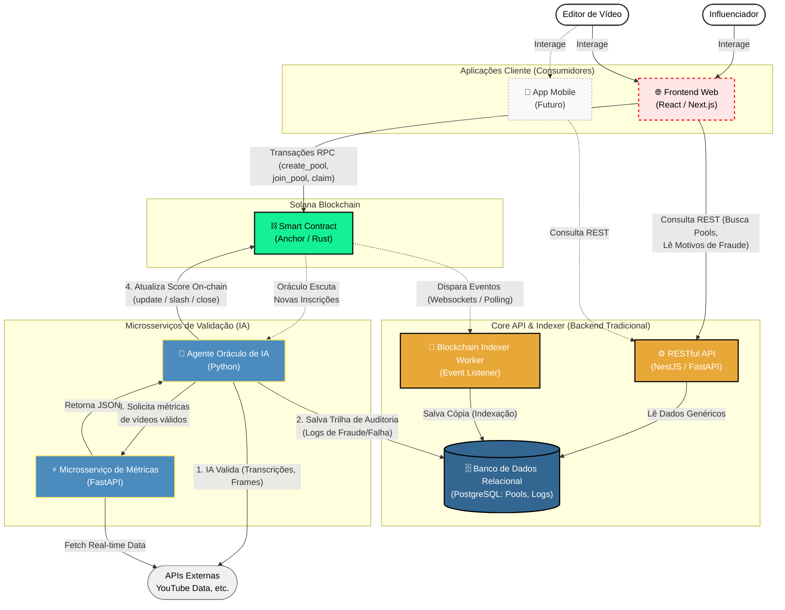

# SolCuts - Creator Economy Hardened Protocol

SolCuts is a decentralized protocol on Solana focused on the Creator Economy. It enables influencers to create **Clip Pools** with SOL prizes, rewarding video editors based on real performance metrics (views, likes, comments) tracked by oracles.

This version is **fully hardened** against fraud, supports multiple clips per editor, and uses an ultra-scalable individual claim model.

---

## 🏛️ Architecture Overview

Este protocolo utiliza uma arquitetura com um **Backend Tradicional (Core API)** focado em domínios, permitindo escalabilidade para múltiplos clientes.



### Detalhamento do Fluxo

1. **Escrita na Blockchain:** Os clientes (Web ou Mobile) comunicam-se diretamente com o Smart Contract via RPC, usando as carteiras dos usuários para assinar transações financeiras e de mudança de estado.
2. **Leitura Indexada:** O **Indexer Worker** escuta a rede Solana e copia dados para o **PostgreSQL**. Os aplicativos listam pools consultando a **RESTful API**, que responde via banco de dados sem sobrecarregar a blockchain.
3. **Auditoria Centralizada:** Quando o **Oráculo de IA** detecta uma fraude, os detalhes técnicos são gravados diretamente na tabela de logs dentro do **PostgreSQL**, compartilhada com a Core API.
4. **Clientes Autônomos:** A Core API expõe os dados. Cabe ao Frontend interpretar o `status: FRAUD_CHANNEL` e notificar o usuário de forma adequada.

### Account PDAs

| Account | Seed | Purpose |
|---------|------|---------|
| `ParticipantEntry` | `["entry", pool_pda, link_hash]` | Entry ticket for a specific clip. `link_hash` is SHA-256 of the clip URL, enabling multiple clips per user per pool. |
| `VideoPool` | `["pool", video_id_string]` | Manages prize pool, score weights, and expiration deadlines. |
| `UserProfile` | `["user_profile", authority]` | User governance state, including ban status (`is_banned`). |
| `PrizeVault` | `["vault", pool_pda]` | Holds SOL prize funds in secure custody until pool expiration. |
| `StakeAccount` | `["stake", user_pda]` | User stake for pool participation (anti-spam). |

---

## 🛡️ Security & Anti-Fraud

SolCuts implements immediate punishment mechanisms:

- **Slash & Ban:** The `slash_user` instruction can be invoked by Oracle or Admin upon fraud detection (e.g., botting, third-party channel links).
- **Consequences:**
  - User profile marked as `is_banned`.
  - User stake may be transferred to treasury.
  - Active pool participations are excluded from prize calculation.

### Score Weights

Pools define weighted scoring:
- Views (configurable weight)
- Likes (configurable weight)
- Comments (configurable weight)

---

## 💰 Fee Economics

| Fee Type | Value | Description |
|----------|-------|------------|
| **Creation** | 0% - 3% | Based on Creator Tier (Bronze to Platinum). |
| **Processing** | 2.5% | Retained from vault before prize distribution. |
| **Minimum Stake** | 0.15 SOL | Protects against spam and malicious behavior. |

---

## 🚀 Setup Guide (Docker Compose)

Este guia explica como configurar e subir todos os componentes do projeto SolCuts com **Docker Compose**.

### Quick Start

```bash
# 1. Gere o .env com as chaves necessárias
./setup.sh

# 2. Edite o .env e insira sua YOUTUBE_API_KEY (obrigatório)
nano .env

# 3. Suba tudo
docker compose up --build
```

### O que o `setup.sh` faz

| Etapa | Descrição |
|-------|-----------|
| 1 | Cria `.env` na raiz a partir de `.env.example` |
| 2 | Gera `APP_API_KEY` compartilhada (Oracle ↔ Metrics API) |
| 3 | Sincroniza `PROGRAM_ID` do `Anchor.toml` |
| 4 | Gera Oracle Keypair via script Python |
| 5 | Valida e mostra o resumo da configuração |

> **Dica**: Use `./setup.sh --force` para recriar o .env e regenerar todas as chaves.

### Serviços Docker

| Serviço | Porta | Descrição |
|---------|-------|-----------|
| `metrics-api` | `8000` | Busca métricas de vídeo (YouTube) |
| `core-api` | `8001` | API REST para Pools, Entries, Audit Logs |
| `oracle` | — | Agente IA que valida e atualiza scores on-chain |

### Variáveis de Ambiente

Todas ficam no **`.env` da raiz** do projeto. O Docker Compose lê automaticamente deste arquivo.

| Variável | Componente | Obrigatória | Descrição |
|----------|-----------|-------------|-----------|
| `APP_API_KEY` | Oracle + Metrics | ✅ | Chave compartilhada para autenticação interna |
| `YOUTUBE_API_KEY` | Metrics | ✅ | Chave da YouTube Data API (Google Cloud) |
| `SOLANA_RPC_URL` | Oracle | ✅ | Endpoint RPC Solana (devnet) |
| `PROGRAM_ID` | Oracle | ✅ | ID do smart contract Anchor |
| `ORACLE_PUBLIC_KEY` | Oracle | ✅ | Chave pública do oráculo |
| `ORACLE_PRIVATE_KEY` | Oracle | ✅ | Chave privada do oráculo |
| `DATABASE_URL` | Core API | ⚙️ | URL do banco de dados (default: SQLite) |
| `CORS_ORIGINS` | Core API | ⚙️ | Origens permitidas para CORS |

### Comandos Úteis

```bash
# Subir em background
docker compose up --build -d

# Ver logs de todos os serviços
docker compose logs -f

# Ver logs de um serviço específico
docker compose logs -f oracle

# Parar tudo
docker compose down

# Parar e remover volumes (reset completo)
docker compose down -v
```

### Configuração Manual Restante

Após rodar o `setup.sh`, você ainda precisa:
1. **YouTube API Key**: Obtenha em [Google Cloud Console](https://console.cloud.google.com/) e coloque em `.env`.
2. **Smart Contract**: `cd programs_colosseum_Hackathon && anchor build && anchor deploy` (fora do Docker).

---

## 🔗 Integration Flow

### 1. Editor Participation (`join_pool`)

Pre-calculate the link hash in the frontend:

```typescript
import * as crypto from "node:crypto";

const link = "https://youtube.com/clip/abc123";
const linkHash = Array.from(crypto.createHash("sha256").update(link).digest());

await program.methods
  .joinPool(linkHash, link, "CHANNEL_ID")
  .accounts({ pool: poolPda, ... })
  .rpc();
```

### 2. Prize Claim (`claim_prize`)

Individual claim model:
1. Oracle calls `close_and_payout` to finalize pool and calculate global scores.
2. Each participant calls `claim_prize` to receive their share from `PrizeVault`.
3. Program calculates exact proportion: `(UserScore / TotalScore) * VaultBalance`.

---

## 💻 Instructions (Smart Contract)

| Instruction | Description |
|-------------|-------------|
| `create_pool` | Create a new clip pool with prize amount and score weights. |
| `join_pool` | Editor joins pool with a specific clip. |
| `update_scores` | Oracle updates scores for pool participants. |
| `close_and_payout` | Oracle closes expired pool and calculates payouts. |
| `claim_prize` | Participant claims their prize share. |
| `slash_user` | Oracle/Admin slashes fraudulent user. |
| `initialize_user` | Initialize user profile. |

---

## 🛠️ Local Development

This project uses a custom patch for `anchor-syn` to ensure build stability.

### Prerequisites

- Anchor CLI `>= 0.30.1`
- Solana Toolsuite

### Build & Test

```bash
# Build the program
cd programs_colosseum_Hackathon
anchor build

# Run automated tests (Localnet)
anchor test
```

---

## 📂 Project Structure

```
.
├── programs_colosseum_Hackathon/
│   ├── programs/colosseum-hackathon/
│   │   ├── src/
│   │   │   ├── state/       # Account state definitions
│   │   │   ├── errors.rs    # Custom errors
│   │   │   └── lib.rs       # Program entrypoint
│   │   └── Cargo.toml
│   ├── tests/               # Integration tests
│   └── migrations/          # Anchor migrations
├── core-api/                # API REST que expõe Pools e Entradas
├── Backend-views-Solana/    # Microsserviço de Métricas
└── AI_agente-Oracle_colosseum_Hackathon/ # Agente Oráculo IA
```

---

## 📄 License

Project developed for the Colosseum Solana Hackathon.