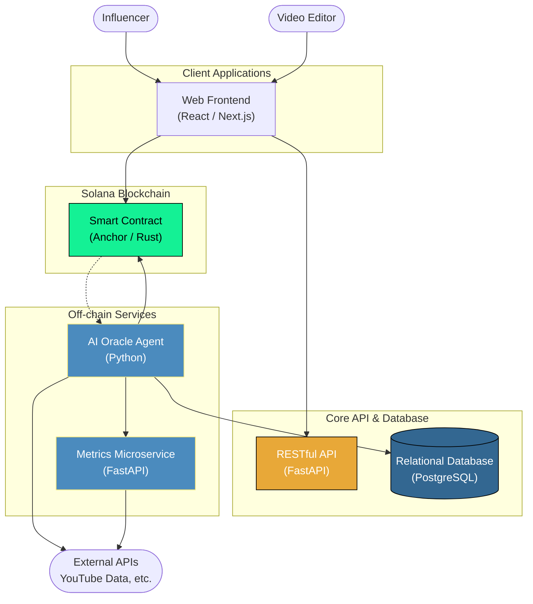

# SolCuts - Creator Economy Hardened Protocol

SolCuts is a decentralized protocol on Solana focused on the Creator Economy. It enables influencers to create **Clip Pools** with SOL prizes, rewarding video editors based on real performance metrics (views, likes, comments) tracked by an AI Oracle.

[View Detailed Project Flows](PROJECT_FLOWS.md)

---

## Architecture Overview


```mermaid
flowchart TD
    Influencer([Influencer])
    Editor([Video Editor])
    ExternalAPI([External APIs\nYouTube Data, etc.])

    subgraph Clients ["Client Applications"]
        Frontend["Web Frontend\n(React / Next.js)"]
    end

    subgraph CoreBackend ["Core API & Database"]
        RestAPI["RESTful API\n(FastAPI)"]
        PostgreSQL[("Relational Database\n(PostgreSQL)")]
    end

    subgraph OnChain ["Solana Blockchain"]
        Solana["Smart Contract\n(Anchor / Rust)"]
    end

    subgraph OffChain ["Off-chain Services"]
        Oracle["AI Oracle Agent\n(Python)"]
        MetricsAPI["Metrics Microservice\n(FastAPI)"]
    end

    Influencer --> Frontend
    Editor --> Frontend
    Frontend --> RestAPI
    Frontend --> Solana
    Solana -.-> Oracle
    Oracle --> ExternalAPI
    Oracle --> PostgreSQL
    Oracle --> MetricsAPI
    MetricsAPI --> ExternalAPI
    Oracle --> Solana

    classDef solana fill:#14F195,stroke:#000,color:#000;
    classDef python fill:#4B8BBE,stroke:#FFE873,color:#fff;
    classDef core fill:#E8A838,stroke:#000,color:#fff;
    classDef db fill:#336791,stroke:#000,color:#fff;
    class Solana solana;
    class Oracle,MetricsAPI python;
    class RestAPI core;
    class PostgreSQL db;
```

### Components

| Component | Description |
|-----------|-------------|
| **Solana Program** (Anchor/Rust) | On-chain smart contract managing pools, entries, scoring, and fraud |
| **Frontend** (React/Next.js) | Web interface for creators and editors |
| **Core API** (FastAPI) | REST API for pools, entries, audit logs. Off-chain data store |
| **AI Oracle Agent** (Python) | Validates submissions, updates scores, detects fraud |
| **Metrics API** | External microservice fetching real-time video metrics |

### Repository Submodules

| Submodule | Path | Purpose |
|-----------|------|---------|
| Solana Program | [programs_colosseum_Hackathon/](programs_colosseum_Hackathon/) | Anchor smart contract with 12 instructions |
| AI Oracle Agent | [AI_agente-Oracle_colosseum_Hackathon/](AI_agente-Oracle_colosseum_Hackathon/) | Off-chain validation & metrics pipeline |
| Frontend | [Dashboard-solana-front/](Dashboard-solana-front/) | Next.js web application |

---

## Quick Start (Docker Compose)

```bash
# 1. Generate .env with required keys
./setup.sh

# 2. Edit .env and insert YOUTUBE_API_KEY
nano .env

# 3. Start everything
docker compose up --build
```

### Services

| Service | Port | Description |
|---------|------|-------------|
| `metrics-api` | 8000 | Fetches video metrics (YouTube) |
| `core-api` | 8001 | REST API for pools, entries, audit logs |
| `oracle` | — | AI Agent, validates and scores on-chain |

### Manual Setup (Outside Docker)

```bash
# Build & deploy Solana program
cd programs_colosseum_Hackathon && anchor build && anchor deploy

# Install & run frontend
cd Dashboard-solana-front && npm install && npm run dev

# Install & run oracle agent
cd AI_agente-Oracle_colosseum_Hackathon && pip install -r requirements.txt && python -m src.main
```

---

## Project Structure

```
.
├── programs_colosseum_Hackathon/     # Solana Anchor program
│   ├── programs/colosseum-hackathon/ # Rust source
│   ├── tests/                        # Integration tests
│   └── docs/                         # Business rules & checklist
├── AI_agente-Oracle_colosseum_Hackathon/  # Python oracle agent
│   ├── src/                          # Agent source code
│   ├── scripts/                      # Backfill & utilities
│   └── docs/                         # Agent documentation
├── Dashboard-solana-front/           # Next.js frontend
├── core-api/                         # REST API backend
├── docker-compose.yaml               # Orchestration
└── setup.sh                          # Environment setup
```

---

## License

Project developed for the Colosseum Solana Hackathon.
