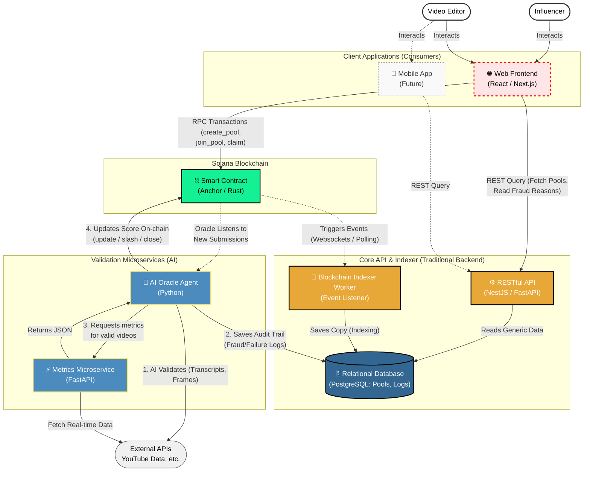

# SolCuts - Creator Economy Hardened Protocol

SolCuts is a decentralized protocol on Solana focused on the Creator Economy. It enables influencers to create **Clip Pools** with SOL prizes, rewarding video editors based on real performance metrics (views, likes, comments) tracked by oracles.

This version is **fully hardened** against fraud, supports multiple clips per editor, and uses an ultra-scalable individual claim model.

[View Detailed Project Flows](PROJECT_FLOWS.md)

---

## 🏛️ Architecture Overview

This protocol uses an architecture with a **Traditional Backend (Core API)** focused on domains, allowing scalability for multiple clients.


```mermaid
flowchart TD
    %% Actors
    Influencer([Influencer])
    Editor([Video Editor])
    ExternalAPI([External APIs\nYouTube Data, etc.])

    %% Clients
    subgraph Clients ["Client Applications (Consumers)"]
        Frontend["🌐 Web Frontend\n(React / Next.js)"]
        MobileApp["📱 Mobile App\n(Future)"]
    end

    %% Traditional Backend
    subgraph CoreBackend ["Core API & Indexer (Traditional Backend)"]
        RestAPI["⚙️ RESTful API\n(NestJS / FastAPI)"]
        IndexerWorker["🔄 Blockchain Indexer Worker\n(Event Listener)"]
        PostgreSQL[("🗄️ Relational Database\n(PostgreSQL: Pools, Logs)")]
    end

    %% Blockchain
    subgraph OnChain ["Solana Blockchain"]
        Solana["⛓️ Smart Contract\n(Anchor / Rust)"]
    end

    %% Python Microservices
    subgraph OffChain ["Validation Microservices (AI)"]
        Oracle["🤖 AI Oracle Agent\n(Python)"]
        MetricsAPI["⚡ Metrics Microservice\n(FastAPI)"]
    end

    %% Interactions User -> Clients
    Influencer -- "Interacts" --> Frontend
    Editor -- "Interacts" --> Frontend
    Editor -. "Interacts" .-> MobileApp

    %% Clients -> Traditional Backend (Read)
    Frontend -- "REST Query (Fetch Pools,\nRead Fraud Reasons)" --> RestAPI
    MobileApp -. "REST Query" .-> RestAPI
    RestAPI -- "Reads Generic Data" --> PostgreSQL

    %% Clients -> Blockchain (Write)
    Frontend -- "RPC Transactions (create_pool,\njoin_pool, claim)" --> Solana

    %% Synchronization Blockchain -> Backend
    Solana -. "Triggers Events (Websockets / Polling)" .-> IndexerWorker
    IndexerWorker -- "Saves Copy (Indexing)" --> PostgreSQL

    %% Oracle Workflow
    Solana -. "Oracle Listens to\nNew Submissions" .-> Oracle
    Oracle -- "1. AI Validates (Transcripts, Frames)" --> ExternalAPI
    
    %% Oracle integrating with the Centralized Backend Database
    Oracle -- "2. Saves Audit Trail\n(Fraud/Failure Logs)" --> PostgreSQL
    
    %% Oracle + Metrics
    Oracle -- "3. Requests metrics\nfor valid videos" --> MetricsAPI
    MetricsAPI -- "Fetch Real-time Data" --> ExternalAPI
    MetricsAPI -- "Returns JSON" --> Oracle

    %% Oracle Write
    Oracle -- "4. Updates Score On-chain\n(update / slash / close)" --> Solana

    %% Styles
    classDef missing fill:#ffe6e6,stroke:#ff0000,stroke-width:2px,stroke-dasharray: 5 5,color:#000;
    classDef external fill:#f0f0f0,stroke:#666,stroke-width:1px,color:#000;
    classDef solana fill:#14F195,stroke:#000,stroke-width:2px,color:#000;
    classDef python fill:#4B8BBE,stroke:#FFE873,stroke-width:2px,color:#fff;
    classDef core fill:#E8A838,stroke:#000,stroke-width:2px,color:#fff;
    classDef db fill:#336791,stroke:#000,stroke-width:2px,color:#fff;
    classDef actor fill:#fff,stroke:#333,stroke-width:2px,color:#000;
    classDef future fill:#f9f9f9,stroke:#999,stroke-width:1px,stroke-dasharray: 3 3;

    class Frontend missing;
    class MobileApp future;
    class Solana solana;
    class Oracle,MetricsAPI python;
    class RestAPI,IndexerWorker core;
    class PostgreSQL db;
    class Influencer,Editor actor;
    class ExternalAPI external;
```

### Flow Details

1. **On-Chain Write:** Clients (Web or Mobile) communicate directly with the Smart Contract via RPC, using user wallets to sign financial and state-changing transactions.
2. **Indexed Read:** The **Indexer Worker** listens to the Solana network and copies data to **PostgreSQL**. Applications list pools by querying the **RESTful API**, which responds via the database without overloading the blockchain.
3. **Centralized Audit:** When the **AI Oracle** detects fraud, technical details are written directly to the logs table within **PostgreSQL**, shared with the Core API.
4. **Autonomous Clients:** The Core API exposes the data. It is up to the Frontend to interpret `status: FRAUD_CHANNEL` and notify the user appropriately.

### Account PDAs

| Account | Seed | Purpose |
|---------|------|---------|
| `ParticipantEntry` | `["entry", pool_pda, link_hash]` | Entry ticket for a specific clip. `link_hash` is SHA-256 of the clip URL, enabling multiple clips per user per pool. |
| `VideoPool` | `["pool", video_id_string]` | Manages prize pool, score weights, and expiration deadlines. |
| `UserProfile` | `["user_profile", authority]` | User governance state, including ban status (`is_banned`). |
| `PrizeVault` | `["vault", pool_pda]` | Holds SOL prize funds in secure custody until pool expiration. |
| `StakeAccount` | `["stake", user_pda]` | User stake for pool participation (anti-spam). |

---

## 🛡️ Security & Anti-Fraud

SolCuts implements immediate punishment mechanisms:

- **Slash & Ban:** The `slash_user` instruction can be invoked by Oracle or Admin upon fraud detection (e.g., botting, third-party channel links).
- **Consequences:**
  - User profile marked as `is_banned`.
  - User stake may be transferred to treasury.
  - Active pool participations are excluded from prize calculation.

### Score Weights

Pools define weighted scoring:
- Views (configurable weight)
- Likes (configurable weight)
- Comments (configurable weight)

---

## 💰 Fee Economics

| Fee Type | Value | Description |
|----------|-------|------------|
| **Creation** | 0% - 3% | Based on Creator Tier (Bronze to Platinum). |
| **Processing** | 2.5% | Retained from vault before prize distribution. |
| **Minimum Stake** | 0.15 SOL | Protects against spam and malicious behavior. |

---

## 🚀 Setup Guide (Docker Compose)

This guide explains how to configure and start all components of the SolCuts project using **Docker Compose**.

### Quick Start

```bash
# 1. Generate .env with the required keys
./setup.sh

# 2. Edit .env and insert your YOUTUBE_API_KEY (required)
nano .env

# 3. Start everything
docker compose up --build
```

### What `setup.sh` does

| Step | Description |
|------|-----------|
| 1 | Creates `.env` in the root from `.env.example` |
| 2 | Generates shared `APP_API_KEY` (Oracle ↔ Metrics API) |
| 3 | Synchronizes `PROGRAM_ID` from `Anchor.toml` |
| 4 | Generates Oracle Keypair via Python script |
| 5 | Validates and shows the configuration summary |

> **Tip**: Use `./setup.sh --force` to recreate the .env and regenerate all keys.

### Docker Services

| Service | Port | Description |
|---------|-------|-----------|
| `metrics-api` | `8000` | Fetches video metrics (YouTube) |
| `core-api` | `8001` | REST API for Pools, Entries, Audit Logs |
| `oracle` | — | AI Agent that validates and updates scores on-chain |

### Environment Variables

All are located in the **root `.env`** of the project. Docker Compose automatically reads from this file.

| Variable | Component | Required | Description |
|----------|-----------|-------------|-----------|
| `APP_API_KEY` | Oracle + Metrics | ✅ | Shared key for internal authentication |
| `YOUTUBE_API_KEY` | Metrics | ✅ | YouTube Data API Key (Google Cloud) |
| `SOLANA_RPC_URL` | Oracle | ✅ | Solana RPC Endpoint (devnet) |
| `PROGRAM_ID` | Oracle | ✅ | Anchor smart contract ID |
| `ORACLE_PUBLIC_KEY` | Oracle | ✅ | Oracle public key |
| `ORACLE_PRIVATE_KEY` | Oracle | ✅ | Oracle private key |
| `DATABASE_URL` | Core API | ⚙️ | Database URL (default: SQLite) |
| `CORS_ORIGINS` | Core API | ⚙️ | Allowed origins for CORS |

### Useful Commands

```bash
# Start in the background
docker compose up --build -d

# View logs for all services
docker compose logs -f

# View logs for a specific service
docker compose logs -f oracle

# Stop everything
docker compose down

# Stop and remove volumes (full reset)
docker compose down -v
```

### Remaining Manual Configuration

After running `setup.sh`, you still need to:
1. **YouTube API Key**: Get it from the [Google Cloud Console](https://console.cloud.google.com/) and place it in `.env`.
2. **Smart Contract**: `cd programs_colosseum_Hackathon && anchor build && anchor deploy` (outside of Docker).

---

## 🔗 Integration Flow

### 1. Editor Participation (`join_pool`)

Pre-calculate the link hash in the frontend:

```typescript
import * as crypto from "node:crypto";

const link = "https://youtube.com/clip/abc123";
const linkHash = Array.from(crypto.createHash("sha256").update(link).digest());

await program.methods
  .joinPool(linkHash, link, "CHANNEL_ID")
  .accounts({ pool: poolPda, ... })
  .rpc();
```

### 2. Prize Claim (`claim_prize`)

Individual claim model:
1. Oracle calls `close_and_payout` to finalize pool and calculate global scores.
2. Each participant calls `claim_prize` to receive their share from `PrizeVault`.
3. Program calculates exact proportion: `(UserScore / TotalScore) * VaultBalance`.

---

## 💻 Instructions (Smart Contract)

| Instruction | Description |
|-------------|-------------|
| `create_pool` | Create a new clip pool with prize amount and score weights. |
| `join_pool` | Editor joins pool with a specific clip. |
| `update_scores` | Oracle updates scores for pool participants. |
| `close_and_payout` | Oracle closes expired pool and calculates payouts. |
| `claim_prize` | Participant claims their prize share. |
| `slash_user` | Oracle/Admin slashes fraudulent user. |
| `initialize_user` | Initialize user profile. |

---

## 🛠️ Local Development

This project uses a custom patch for `anchor-syn` to ensure build stability.

### Prerequisites

- Anchor CLI `>= 0.30.1`
- Solana Toolsuite

### Build & Test

```bash
# Build the program
cd programs_colosseum_Hackathon
anchor build

# Run automated tests (Localnet)
anchor test
```

---

## 📂 Project Structure

```
.
├── programs_colosseum_Hackathon/
│   ├── programs/colosseum-hackathon/
│   │   ├── src/
│   │   │   ├── state/       # Account state definitions
│   │   │   ├── errors.rs    # Custom errors
│   │   │   └── lib.rs       # Program entrypoint
│   │   └── Cargo.toml
│   ├── tests/               # Integration tests
│   └── migrations/          # Anchor migrations
├── core-api/                # REST API that exposes Pools and Entries
├── Backend-views-Solana/    # Metrics Microservice
└── AI_agente-Oracle_colosseum_Hackathon/ # AI Oracle Agent
```

---

## 📄 License

Project developed for the Colosseum Solana Hackathon.